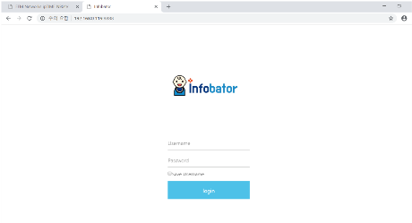
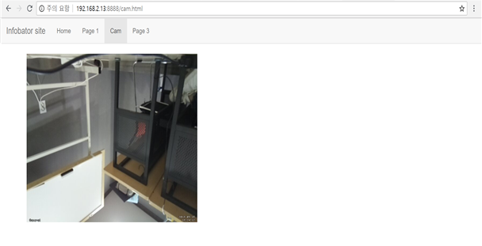
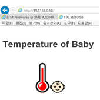
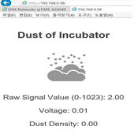
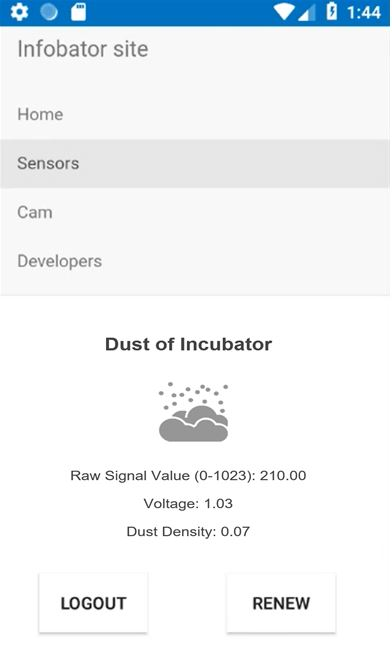
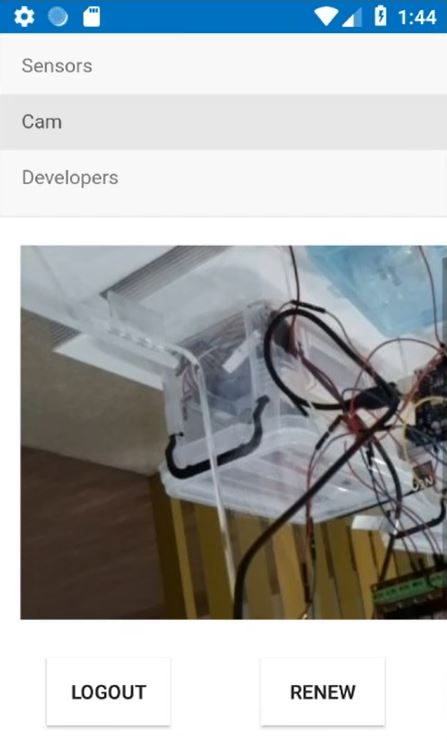
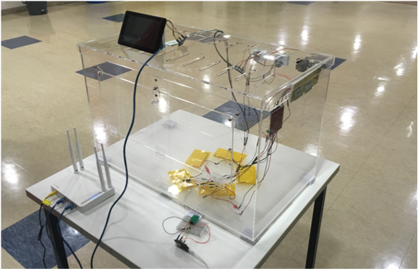
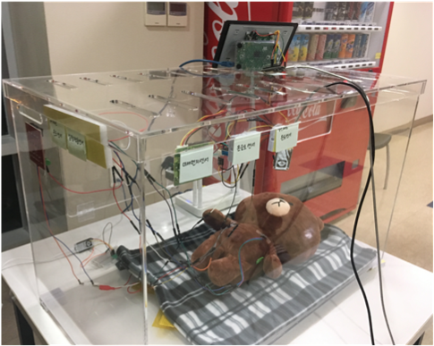

# Infobator (Kibwa ICT_2018)

__Infobator(Incubator + Information)__
__Infobator는 Incubator 와 Information이 합쳐진 단어로, 정보를 전달하는 인큐베이터입니다.__

Infobator is a word that combines Incubator and Information, and is an incubator that delivers information.

장비의 노후화로 인큐베이터 사고가 해마다 발생하는 기사를 바탕으로, 문제를 해결하고자 프로젝트를 진행하였습니다.

## 👨 💻프로젝트 주요 내용

### 💻Web Version 

 ● Infobator 메인 화면
  

 ● Raspberry PI 카메라 센서 웹페이지 연동
  

 
 ● 온도 센서 웹페이지 연동
  

 
 ● 미세먼지 센서 웹페이지 연동
  

### 📱Mobile Version 

 ● Infobator 메인 화면
  

 
 ● 미세먼지 센서 연동
  

 ● Raspberry PI 카메라 센서 연동
  

### 💡Infobator 모델링 
  

  

  
